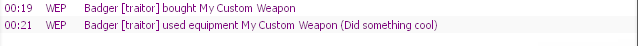

You can modify the code for TTT weapons and entities to provide more information for the damage logs.<br>
This is done by calling the hook `TTTEquipmentUse`.

# Example
```lua
-- In your weapon's code

SWEP.PrintName = "My Custom Weapon"

function SWEP:PrimaryAttack()
    local playerUsingEquipment = self:GetOwner()
    local equipment = self
    local description = "Did something cool"
    hook.Call("TTTEquipmentUse", nil, playerUsingEquipment, equipment, description)
end
```

In-game, this looks like the following:<br>


---
